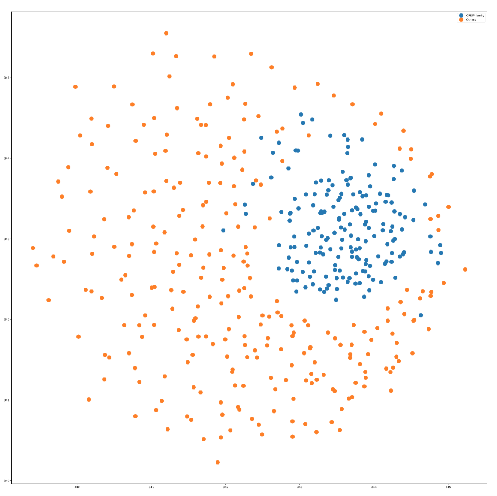

# UMAP
```python
seqlearner.MultiTaskLearner.visualize(method="UMAP", family=None, proportion=1.5)
```
Uniform Manifold Approximation and Projection (UMAP) is a dimension reduction technique that can be used for visualisation similarly to t-SNE, but also for general non-linear dimension reduction. 
The algorithm is founded on three assumptions about the data
1. The data is uniformly distributed on a Riemannian manifold;
2. The Riemannian metric is locally constant (or can be approximated as such);
3. The manifold is locally connected.

The details about the underlying mathematics of `UMAP` method can be found in the following paper:
- McInnes, L, Healy, J, UMAP: Uniform Manifold Approximation and Projection for Dimension Reduction, ArXiv e-prints 1802.03426, 2018

We have used the sklearn wrapper function which implements `UMAP` and applied it on the embedding results.
The `visualize` method has the following arguments:
### Arguments
- __method__: String, Possible values are `TSNE` and `UMAP`
- __family__: String, Name of protein family to be visualized
- __proportion__: Positive float, population proportion of number of other classes by number of 

## Apply UMAP visualization on  CRISP Protein family
```python
from seqlearner import MultiTaskLearner as mtl
import pandas as pd
from seqlearner import Freq2Vec
sequences = pd.read_csv("./protein_sequences.csv", header=None)
freq2vec = Freq2Vec(sequences, word_length=3, window_size=5, emb_dim=25, loss="mean_squared_error", epochs=250)
freq2vec.freq2vec_maker()
freq2vec_embedding = mtl.embed(word_length=3, embedding="freq2vec", func="sum", emb_dim=25, gamma=0.1, epochs=100)
mtl.visualize(method="UMAP", family="CRISP_family", proportion=2.0)
```
The visualization plot is in the following:


